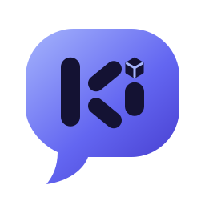

<h1>&nbsp;kikomi</h1>

*kikomi* comes from the Japanese *kiku* (聞く, "to listen") and *komi*, short for communicate.

kikomi is a Discord bot that joins your voice channel, listens, and talks back as a character.
Several people can talk to it at once. It knows who said what, remembers the conversation,
and starts speaking before it has finished thinking of the whole reply.

- **Hears you**: per-person speech detection and [faster-whisper](https://github.com/SYSTRAN/faster-whisper) speech recognition, on your GPU or CPU.
- **Thinks**: Claude through the Anthropic API (recommended), or any OpenAI-compatible local model (Ollama, LM Studio, llama.cpp, vLLM).
- **Talks with feeling**: the voice changes with the character's mood (happy, sad, surprised...). Over 300 free Microsoft Edge voices to choose from, and changing the voice is one command.
- **Speaks your language**: understands about 99 languages, answers in whichever one you use, and can switch between languages mid-conversation, even mid-reply, in the same voice (see [Languages](#languages)).
- **Works with Discord's encrypted voice**: handles DAVE, the end-to-end encryption every voice channel has used since March 2026 (see [How it works](#how-it-works)).
- **Asks first**: by default it only listens to people who opt in, and never saves audio.
- **Characters**: a character is a short YAML file with a personality and a voice.

> kikomi is a sister project to **[hikomi](https://hikomi.ai)**, the AI companion desktop app by HIKOMI LABS.
> It is an independent, open-source take on the idea for Discord, and shares no code or assets with hikomi.

## Setup

### 1. Install what kikomi needs

- **[Python](https://www.python.org/downloads/) 3.10 to 3.13.** On Windows, tick "Add Python to PATH" in the installer.
- **[FFmpeg](https://ffmpeg.org/download.html)**, which kikomi uses to play audio. On Windows the easiest way is
  `winget install Gyan.FFmpeg` in a terminal. Check it worked by opening a new terminal and running `ffmpeg -version`.
- **[Git](https://git-scm.com/downloads)**, to download the project.
- On Linux only: the Opus audio library (`sudo apt install libopus0`).

### 2. Download kikomi and install it

```bash
git clone https://github.com/OutHypeR/kikomi
cd kikomi
python -m venv .venv
.venv\Scripts\activate
pip install -e .
```

On Linux or macOS, activate with `source .venv/bin/activate` instead.
If you have an NVIDIA graphics card, use `pip install -e ".[gpu]"`. Speech recognition becomes around ten times faster.

Then make your own copies of the settings files:

```bash
copy .env.example .env
copy config.example.yaml config.yaml
```

(On Linux or macOS, use `cp` instead of `copy`.) `.env` holds your secret keys and `config.yaml` holds your settings.
Git ignores both, so they are never uploaded anywhere.

### 3. Create the Discord bot and get its token

1. Go to the [Discord Developer Portal](https://discord.com/developers/applications) and sign in.
2. Click **New Application**, give it a name (for example "kikomi"), and accept the terms.
   You can set a profile picture on the **General Information** page if you like.
3. In the left sidebar, click **Bot**.
4. Click **Reset Token**, confirm, and **copy the token**. Discord only shows it once. If you lose it, just reset it again.
5. Open `.env` in a text editor and paste the token after `DISCORD_TOKEN=`, with no quotes or spaces:
   ```
   DISCORD_TOKEN=paste-your-token-here
   ```
6. Still on the **Bot** page, you can leave the three "Privileged Gateway Intents" switched off. kikomi doesn't need them.

> **Keep your token secret.** Anyone who has it can control your bot. Don't share it, post it, or commit it.
> If it ever leaks, click **Reset Token** straight away; the old one stops working.

### 4. Invite the bot to your server

1. In the sidebar, click **OAuth2**, then **URL Generator**.
2. Under **Scopes**, tick `bot` and `applications.commands`.
3. Under **Bot Permissions**, tick **View Channels**, **Send Messages**, **Connect**, **Speak**, **Use Voice Activity**
   and **Change Nickname** (so its name in the member list matches the name you give it).
4. Copy the URL at the bottom of the page, open it in your browser, choose your server and click **Authorize**.

### 5. Optional: make slash commands appear instantly

Discord can take a few minutes to show a new bot's slash commands. To see them straight away on your own server:

1. In Discord, open **User Settings → Advanced** and switch on **Developer Mode**.
2. Right-click your server's icon and click **Copy Server ID**.
3. Paste it into `.env` after `DEV_GUILD_ID=`.

### 6. Choose the AI that writes the replies

- **Claude** (the default): create an API key in the [Anthropic Console](https://console.anthropic.com)
  and paste it into `.env` after `ANTHROPIC_API_KEY=`. This is a paid service, charged per use.
- **A free model on your own computer**: install [Ollama](https://ollama.com), run `ollama pull llama3.1:8b`,
  then change the `llm` section of `config.yaml` to:
  ```yaml
  llm:
    provider: openai_compatible
    model: llama3.1:8b
    base_url: http://localhost:11434/v1
  ```

### 7. Start kikomi

From the kikomi folder, with the virtual environment active (step 2):

```bash
python -m kikomi
```

The first start downloads the speech recognition model, which takes a minute or two.
When the log shows `Logged in as ...`, the bot is online.

**To stop it**, press **Ctrl+C** in its window, or run `python -m kikomi --stop` from another terminal. Either way
it leaves voice first. Avoid just closing the window or ending the process: then it can't say goodbye, and
Discord keeps showing it in the voice channel for about 30 seconds until it times out.

### 8. Set it up for your server (do this on the first join)

> **Out of the box, the bot only understands English.** Whoever has access to the bot's settings on a
> server (by default, anyone with **Manage Server**; see [Permissions](#permissions)) should run
> **`/setup`** the first time the bot joins voice there. Until someone does, the bot reminds you when it joins.

**Name it.** The first time the bot joins voice on a server, it asks what it should be called there, with two
buttons: **Choose a name** (type any name, e.g. "Luna") or **Keep Nova**. If nobody answers within 10 minutes,
it stays Nova. The name is what people say to wake it, it replaces "Nova" in its personality and greeting, and
it becomes the bot's nickname on your server (this needs the **Change Nickname** permission).
Only people who can manage the server can choose. It can be changed any time with **Rename** in `/setup`.

`/setup` opens a menu that only you can see:

- **Languages**: tick every language people speak on your server. Speech is only ever recognised as one of
  these, so a short phrase is never mistaken for another language. Leave English as the only one if that's
  all your server speaks.
- **Mode**: *wake* (answers when its name is said) or *always* (answers everything it hears).
- **Character**: who the bot plays on this server. The **Rename** button gives it a different name here.
- **Transcripts**: whether it posts what it heard and said. They go in the voice channel's text chat;
  to send them to a channel of your own (like `#kikomi-logs`), use `/transcripts`.

Press **Save**. Each server has its own settings, so setting up one server doesn't change another.
Run `/setup` again whenever you want to change them. The voice is chosen separately, with `/voice`.

### 9. Talk to it

Join a voice channel and run **/join**. Everyone who wants to be heard runs **/optin** once per server.
In the default `wake` mode, say its name ("Hey Nova, ..."). After it answers you, you can keep talking
for a little while without saying the name again. Talking over it makes it stop and listen.

You can also @mention the bot in any text channel to chat in text.

| Command | What it does |
|---|---|
| `/join` | Join your voice channel |
| `/rejoin` | Leave and come straight back, keeping the conversation. Use it if the bot stops hearing or speaking |
| `/leave` | Leave the voice channel |
| `/stop` | Stop talking right now, without leaving |
| `/listen on\|off` | Pause or resume listening, without leaving |
| `/optin` / `/optout` | Let the bot hear you on this server / stop it |
| `/reset` | Forget the conversation |
| `/status` | What the bot is doing, and whether it can hear you (only you see the answer) |
| `/help` | List all the commands |
| `/setup` | Choose languages, mode, character and transcripts for this server \* |
| `/mode wake\|always` | Answer only when named, or answer everything \* |
| `/character <name>` | Switch character on this server \* |
| `/voice` | Change the character's voice on this server \*; see below |
| `/say <text> [mood]` | Make the bot say something out loud \* |
| `/transcripts` | Choose where transcripts go: the voice channel's chat, a channel you pick, or nowhere \* |

\* Only for people with access to the bot's settings; see [Permissions](#permissions).

Each listener can change how loud the bot is for them with Discord's own volume slider
(right-click the bot in the voice channel).

## Permissions

Commands that change how the bot behaves (`/setup`, `/mode`, `/character`, `/voice`, `/say` and
`/transcripts`) are hidden
from everyone who doesn't have the **Manage Server** permission. Discord enforces this itself.

To give other people access, for example a "Bot Admin" role, or to take it away, use Discord's own settings:
**Server Settings → Integrations →** your bot (whatever you named it in step 3), then pick a command and add or remove roles, members or channels.
Everyday commands (`/join`, `/leave`, `/stop`, `/optin` and so on) are open to everyone.

## Characters

Characters live in `characters/`. Copy [`characters/nova.yaml`](characters/nova.yaml), edit the name, wake words,
personality and voice, and pick it for your server with `/setup` or `/character`. The `character:` in
`config.yaml` is what servers get before they've chosen.

### Changing the voice

The easiest way is the **`/voice`** command in Discord:

1. Type `/voice` and click the **name** box.
2. Start typing to search: `female british`, `male`, `aria`, `japanese`, `en-au`...
3. Pick a voice from the list. If the bot is in a voice channel, it says a line so everyone can hear it.

You can also make the voice faster or slower with **speed** (10 is a bit faster, -10 a bit slower) and higher
or lower with **pitch** (15 is a bit higher, -15 a bit lower). Run `/voice` on its own to see the current
voice, and `/voice reset:True` to go back to the voice in the character file.
The choice is remembered for that character on your server, even after a restart.

To browse all 300+ voices from the terminal (searching works the same way):

```bash
python -m kikomi --voices
python -m kikomi --voices female british
```

Or set the voice in the character file, under `voice:`, with `edge:` (the voice), `rate:` (speed) and `pitch:`.

### Languages

kikomi is multilingual out of the box:

- **Hearing**: speech recognition understands about 99 languages. Each server picks the ones its people
  speak in `/setup` (English only until then). With one language, everything is heard as that language;
  with several, each sentence is heard as whichever of them it sounds most like, so people can switch freely.
- **Replying**: the AI answers in the language it was spoken to, and can mix languages naturally. Ask
  "how do you say 名字 in English?" and it answers in English with the Chinese word in place.
- **Speaking**: Nova's default voice, **Emma Multilingual**, speaks English and dozens of other languages
  (Chinese, Japanese, Korean, Spanish, French, German and many more) in the *same* voice, so the character
  sounds like one person whatever language it's using. Chinese and Japanese replies are split into sentences
  too, so speech starts just as quickly as in English.
- **Never silent**: most voices speak only their own language. If you pick one of those and a reply comes
  out in a language it can't speak, a **backup voice** says that sentence instead (`backup:` in the
  character file; by default Emma Multilingual).

Tips:

- **Only pick the languages people actually speak.** Every extra language is one more thing a short, unclear
  phrase could be mistaken for. `/setup` offers the 25 most common; `stt.languages` in `config.yaml` sets the
  default for new servers and accepts any of the ~99 (as codes like `en`, `zh`, `ja`).
- **Want a native accent?** Pick a voice made for that language with `/voice` (search "japanese", "taiwan",
  "spanish"...). Multilingual voices sound natural in many languages but are strongest in English.
- **Wake words in other scripts:** speech recognition writes names in the language being spoken, so "Nova"
  said in Chinese may come out as 諾瓦. Add those spellings to `wake_words` in the character file, or just
  start with "Hey Nova" in English.
- **Better accuracy for less common languages:** use a bigger speech model, e.g. `stt.model: large-v3-turbo`
  (needs a decent graphics card).

### Emotion in the voice

The AI starts each reply with a mood, like `[happy]` or `[sad]`, and can switch mood part-way through
("[happy] You won! [surprised] Wait, first try?"). The mood changes how the voice sounds: its speed,
pitch, warmth and loudness, on top of whichever voice you picked. You can tune the moods, or add your
own, under `moods:` in a character file.

### Private characters

Anything in `characters/private/` stays on your computer: git ignores that folder, so it's never
uploaded. A file there with the same name as a character adds to or overrides that character, for
example to tune Nova's moods or personality just for yourself, without changing the public character.

## Configuration

Everything is in [`config.example.yaml`](config.example.yaml), with comments. The settings you're most likely to change:

- `stt.model`: `small` is a good default. `large-v3-turbo` is more accurate if you have a GPU.
- `listening.volume_threshold`: raise it if background noise sets the bot off, lower it if quiet voices get missed.
- `listening.silence_ms`: how long a pause ends a sentence.
- `llm.effort`: `low` keeps Claude's voice replies quick.

## Privacy

This bot records people, so please run it responsibly:

- By default it **only processes the voice of people who ran `/optin`**. Everyone else's audio is discarded
  as soon as it arrives. The only thing it stores is the list of opted-in user IDs (`data/consent.json`).
- **Audio is never written to disk.** Speech is turned into text in memory and the audio is thrown away.
- The text of what people say is sent to the language model you configured (Anthropic, or your own local model),
  and each reply is sent to the TTS service (Microsoft's Edge voices by default).
- Conversation memory is kept in RAM only, per server, and is cleared by `/reset` or a restart.
- With transcripts on (a per-server choice in `/setup`), what the bot heard and said is posted so everyone
  can see it: in the voice channel's text chat, or in the channel picked with `/transcripts`. If you send them
  to a separate channel, remember that everyone who can see that channel can read them. The bot needs
  **View Channel** and **Send Messages** there.
- Each server's `/setup` choices are saved in `data/servers.json`.

If you run a public instance, you are responsible for following Discord's
[Developer Terms](https://discord.com/developers/docs/policies-and-agreements/developer-terms-of-service) and
[Developer Policy](https://discord.com/developers/docs/policies-and-agreements/developer-policy),
including telling users what you collect.

## How it works

```
voice packets ──► transport decrypt ──► DAVE decrypt ──► Opus decode ──► per-person buffer
                  (voice-recv)          (this project)                  (ends after a pause)
                                                                               │
     speaker ◄── TTS per sentence ◄── sentence splitter ◄── LLM stream ◄── Whisper
```

- `kikomi/dave_recv.py`: discord.py 2.7 joins the encrypted DAVE session but only uses it for sending.
  This adds the missing receive step: after `discord-ext-voice-recv` removes the transport encryption,
  each frame is decrypted with its sender's DAVE key.
- `kikomi/listener.py`: splits each person's audio into utterances by volume and pauses.
- `kikomi/session.py`: decides when to answer, streams the reply, and speaks it sentence by sentence.
- `kikomi/servers.py`, `setup_menu.py` and `naming.py`: each server's own settings, the `/setup` menu, and naming.
- `kikomi/llm.py`, `stt.py`, `tts.py`: the swappable model back ends.

Run the tests with `pip install -e ".[dev]"` and `pytest`.

## Licence

[GNU AGPL-3.0](LICENSE). You can use, change and share this freely. If you run a modified version as a
service for others, you have to share your changes under the same licence.
